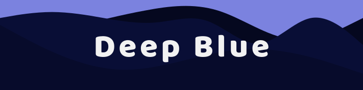

  

---

  <!-- marketplace version -->
  
  <!-- downloads -->
  

---

> _Not the chess computer_

This is a dark blue theme inspired by [NightOwl](https://marketplace.visualstudio.com/items?itemName=sdras.night-owl) and [Shades of Purple](https://marketplace.visualstudio.com/items?itemName=ahmadawais.shades-of-purple)

  

##  Installation

1. Open the extensions sidebar (`Ctrl + Shift + X`)
2. Search for "Deep Blue"
3. Click Install
4. Click Reload
5. Change your Theme
    - Open Command Palette (`Ctrl + Shift + P`)
    - Search for "Preferences: Color Theme"
    - Select Deep Blue

  

##  Example Screenshots

### Javascript

### Typescript

### HTML

### CSS / SCSS

### React / JSX

### Vue

### Rust

  

## License

[MIT](LICENCE) © [Julian Kaindl](https://github.com/KaindlJulian)
